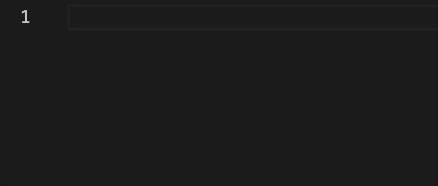
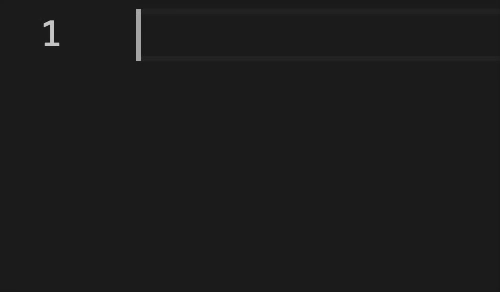
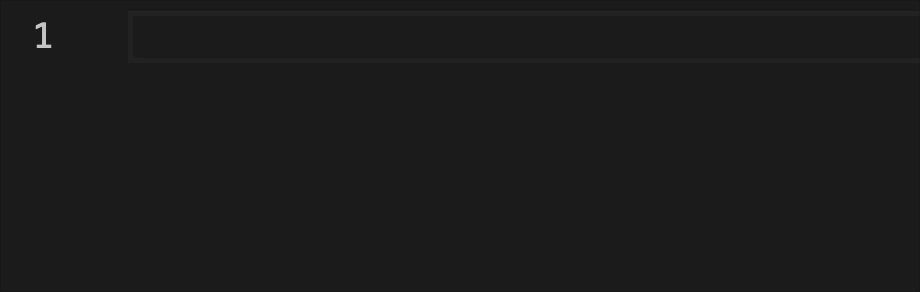
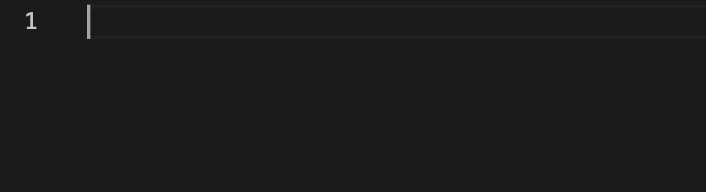
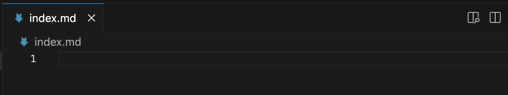

# markdown-commands

An extension for enhanced Markdown format editing with utility commands. It provides slash commands, shortcuts, and command palette entries to quickly insert commonly used Markdown elements. Designed to reduce manual formatting and streamline writing workflows. Supports Markdown (`.md`) and Markdown with JSX (`.mdx`) file formats.

## Features

Create and insert Markdown formatted elements:

- [Tables](#tables)
- [Ordered lists](#ordered-lists)
- [Unordered lists](#unordered-lists)
- [Horizontal rules](#horizontal-rule)
- [Hyperlinks](#hyperlink)
- [Images](#image)
- [Code blocks](#code-blocks)

## Usage

### Tables

```
/table <columns> <rows>
```



<br />

**Shortcut:** `Ctrl+Shift+T` (Windows/Linux) / `Cmd+Shift+T` (macOS)

**Command palette:** `Markdown: Create Table`

---

### Ordered Lists

```
/olist <number_of_items>
```


<br />

**Shortcut:** `Ctrl+Shift+O` (Windows/Linux) / `Cmd+Shift+O` (macOS)

**Command palette:** `Markdown: Create Ordered List`

---

### Unordered Lists

```
/ulist <number_of_items>
```


<br />

**Shortcut:** `Ctrl+Shift+U` (Windows/Linux) / `Cmd+Shift+U` (macOS)

**Command palette:** `Markdown: Create Unordered List`

---

### Horizontal Rules

 `/hr`



<br />

**Shortcut:** `Ctrl+Shift+H` (Windows/Linux) / `Cmd+Shift+H` (macOS)

**Command palette:** `Markdown: Insert Horizontal Rule`

---

### Hyperlinks

 `/link`



<br />

**Shortcut:** `Ctrl+Shift+L` (Windows/Linux) / `Cmd+Shift+L` (macOS)

**Command palette:** `Markdown: Insert Hyperlink`

---

### Images

 `/img`



<br />

**Shortcut:** `Ctrl+Shift+I` (Windows/Linux) / `Cmd+Shift+I` (macOS)

**Command palette:** `Markdown: Insert Image`

### Code blocks

 `/codeblock`

 

<br />

**Shortcut:** `Ctrl+Shift+C` (Windows/Linux) / `Cmd+Shift+C` (macOS)

**Command palette:** `Markdown: Insert Code Block`

---

## Installation

- [VS Code Marketplace](https://marketplace.visualstudio.com/items?itemName=jurajstefanic.md-commands)
