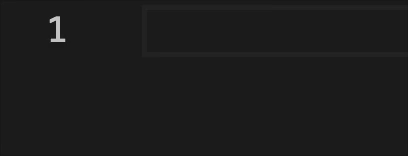

# markdown-commands

An extension for enhanced Markdown format editing with utility commands.

## Features

- Create and insert [tables](#tables) with a simple command
- Create and insert [ordered lists](#ordered-lists) with a specified number of items
- Create and insert [unordered lists](#unordered-lists) with a specified number of items
- Create and insert [horizontal rules](#horizontal-rule)
- Create and insert [hyperlinks](#hyperlink)
- Create and insert [images](#image)

## Usage

### Tables

```
/table <columns> <rows>
```


<br />

**Shortcut:** `Ctrl+Shift+T` (Windows/Linux) / `Cmd+Shift+T` (macOS)

**Command palette:** `Markdown: Create Table`

### Ordered Lists

```
/olist <number_of_items>
```



<br />

**Shortcut:** `Ctrl+Shift+O` (Windows/Linux) / `Cmd+Shift+O` (macOS)

**Command palette:** `Markdown: Create Ordered List`

### Unordered Lists

```
/ulist <number_of_items>
```


<br />

**Shortcut:** `Ctrl+Shift+U` (Windows/Linux) / `Cmd+Shift+U` (macOS)

**Command palette:** `Markdown: Create Unordered List`

### Horizontal Rule

`/hr`

```
---
```

**Shortcut:** `Ctrl+Shift+H` (Windows/Linux) / `Cmd+Shift+H` (macOS)

**Command palette:** `Markdown: Insert Horizontal Rule`

### Hyperlink

 `/link`

```
[Link Text](https://example.com)
```

**Shortcut:** `Ctrl+Shift+L` (Windows/Linux) / `Cmd+Shift+L` (macOS)

**Command palette:** `Markdown: Insert Hyperlink`

### Image

 `/img`

```

```

**Shortcut:** `Ctrl+Shift+I` (Windows/Linux) / `Cmd+Shift+I` (macOS)

**Command palette:** `Markdown: Insert Image`

## Installation

- Install from [VS Code Marketplace](https://marketplace.visualstudio.com/items?itemName=jurajstefanic.md-commands)
